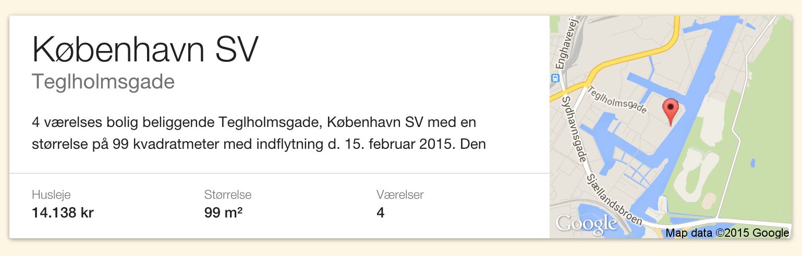
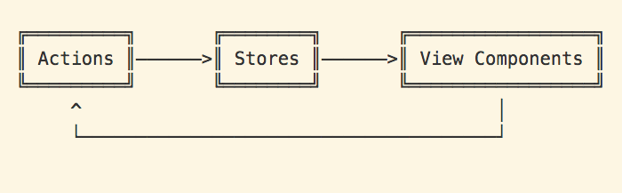
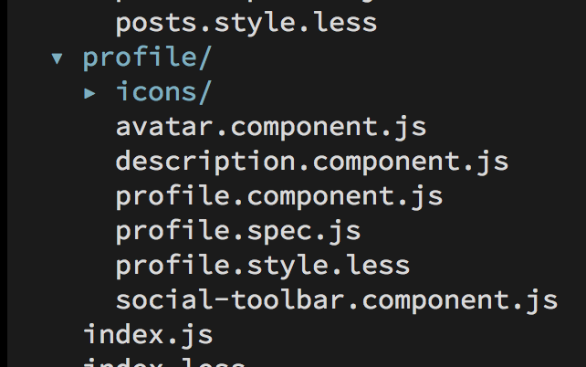
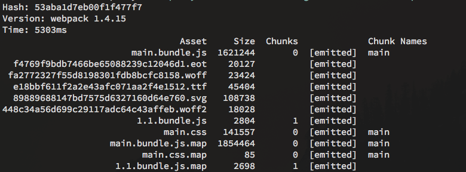

# React, Webpack, Flux
## Isomorphism, Server Rendering, ES6, VDOM, Immutability...
Buzzwords... Buzzwords everywhere.

---

# chriskjaer
Fullstack Udvikler @ Boligbesked

---

# React?
> "a javascript library for building user interfaces"


## React Concepts
- Virtual DOM
- One-way databinding
- JSX


## JSX
“Templates separate technologies, not concerns.”


## Example
```javascript
import React from 'react';

let Example = React.createClass({
  render: function() {
    return (
      <div>
        <h1>Haters Gonna Hate</h1>
        <p>Look {this.props.name}, HTML in my JavaScript!</p>
      </div>
    );
  }
});

React.render(<Example name='everybody!' />, document.body);
```


```javascript
  let data = {
    title: 'København SV',
    description: '4 værelses bolig beliggende Teglhomsgade...'
    ...
  };

  React.render( <Dwelling {...data}/>, document.body );
```



## Everything as a component
```javascript
  import GoogleMap from '../shared/google-map';
  import Details from './details.component';
  import Title from './title.component';
  import Description from './description.component';

  let Dwelling = React.createClass({
    render: function() {
      return (
        <div>
          <Title main={this.props.city} sub={this.props.street} />
          <Description text={this.props.teaser}/>
          <GoogleMap lat={this.props.lat} lng={this.props.lng} />
          <Details data={this.props.details}/>
        </div>
      );
    }
  });
```


## Cons
- New framework
- You decide the stack


## Pros
- You decide the stack
- Minimal API to learn
- Encourages vanilla javascript
- Feels like writing javascript
- Server Side Rendering
- Testing

---

# Flux
> "Application architecture for building user interfaces"


## Multiple Implementations
- Flux
- Fluxxor
- DeLorean
- Marty


## RefluxJS



## Action
```javascript
  import Reflux from 'reflux';

  let Actions = Reflux.createActions({
    fetchData: { asyncResult: true }
  });

  Actions.fetchData.listenAndPromise(
    num => xhr.get( `/latest?amount=${num}` )
  );

  export default Actions;
```


## Store
```javascript
  import Reflux from 'reflux';
  import Actions from './example.actions';

  let Store = Reflux.createStore({
    listenables: Actions,

    onFetchDataCompleted: function(response) {
      this.data = response.data;
      this.trigger(this.data);
    },

    onFetchDataFailed:
      response => console.error(response.data)
  });

  export default Store;
```


## View
```javascript
  import React from 'react';
  import Reflux from 'reflux';
  import Store from './example.store';
  import { fetchData } from './example.actions';
  import { Dwelling, Loading } from './dwelling.component';

  React.createClass({
    mixins: [ Reflux.connect(Store, 'data') ],
    componentWillMount: fetchData,
    render: function() {
      if ('data' in this.state) {
        return this.state.data.map( data => <Dwelling {...data} /> );
      }
      else return <Loading />
    }
  });
```


## Cons
- No 'best practices'
- Sparse documentation
- Server side rendering can be tricky


## Pros
- RefluxJS makes it easier to decouple domains
- Actions tells the truth
- Flat learning curve
- 'WYSIWYG'

---

# Webpack
> module bundler


- Like Browserify
- Transforms are called loaders
- Works with everything. Commonjs, AMD


## Encapsulated Components



```javascript
  import 'example.style.less';
  import github from 'github.icon.svg';
  import React from 'react';

  let Github = React.createClass({
    render: function() {
      return (
        <a href='https://github.com/chriskjaer'>
          <i dangerouslySetInnerHTML={{ __html: github }} />
          Github
        </a>
      );
    }
  });
```


## Code splitting & Async loading
```
import { Mixin } from 'react-proxy!./github.component';

let GithubAsync = React.createClass({
  mixins: [Mixin],

  renderUnavailable: function() {
    return <p>Loading...</p>;
  }
});
```


## Gives



## Can also export your app as:
- node module
- webworker
- browser
- Commonjs / AMD / UMD


## Cons
- Configuration over code (Like Grunt)
- Loaders strays from traditional require
- Documentation could be better


## Pros
- Works out of the box with existing solutions
- Extremely good for SPA
- React-hot-loader
- Code splitting
- Webpack + Make
  - Eliminates the need for Grunt/Gulp

---

# What did we learn?


## Cons with this stack

- No large opensource examples
  - Best practices
  - Workflow
  - Composition
- Dependencies changes fast
- Running the app on the server
  - Async data
  - DOM Dependent API's


## Pros with this stack

- (Re)flux - easy to reason about data
- Isomorphic
- Easy i18n (React Intl)
- Great Routing (React Router)
- Testing Components
- No Context Switching (javascript everywhere)
- Vanilla Javascript
- Multiple async app bundles (Webpack)


## Near future
- React Native
- Relay + GraphQL
- Immutability.js

---

## Thank you!
Github [@chriskjaer](http://github.com/chriskjaer)

LinkedIn [@chriskjaer](http://dk.linkedin.com/in/chriskjaer/en)

Twitter: [@ckjaer](https://twitter.com/ckjaer)
